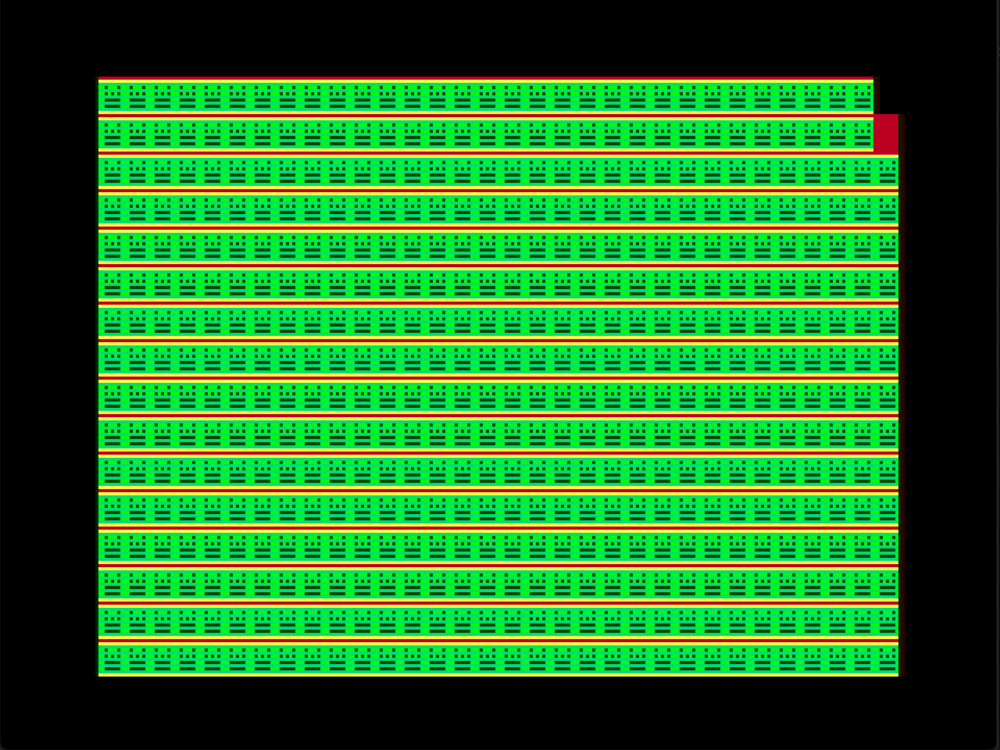
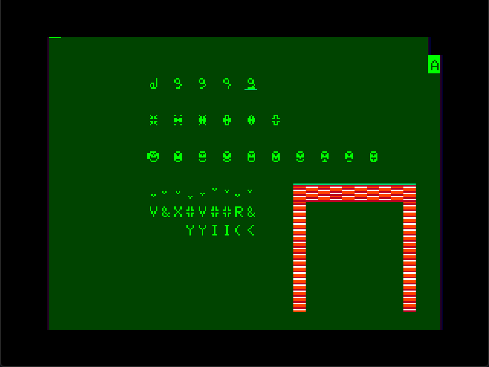

# Semidraw24  
**A Semigraphics 24 drawing program with a touch of animation**  
**`CoCo`**  
  
The **elusive** and criminally underused **Semigraphics** modes on the **CoCo** always fascinated me. I had as given that you needed **Assembly** to access them but when I studied a little more and found out that they were **perfectly accessible** and usable in **Basic** this little exploration program came out.  
  
**Semidraw24** is a Basic paint program using the Semigraphics 24 mode of the **CoCo 2**. It does not have the classic *circle*, *box* or *lines* of traditional paint programs, being more driven toward the creation of patterns and characters with the mix and match capabilities of the semigraphics mode.  
It also support a bit of animation. You can animate a character block by stating a sequence of character "frames" and a speed to go though.  
It is useful to prototype and design interface elements of other semigraphics programs and was very handy when designing the characters of the semigraphics version of [Yayasg!](https://github.com/farique1/8bitcode/tree/main/Yayasg)  
  
Because the Disk Basic routines are located right after the screen memory address and the semigraphics extends this area twelvefold, the conflict prevents **Semidraw24** from running on a Disk Basic **CoCo**. I already know how to circumvent this problem and a disk version is coming soon.  
  
SG 24 Texture|Yayasg! Art Study  
:-------------------------:|:-------------------------:  
  |    
  
**The keys to control **Semidraw24** are:**  
  
	ARROWS 			- Move the cursor, hold for continuous movement  
	/ 			- Toggle 12x movement step on the Y axis  
	SPACE 			- Draw. Hold to keep drawing  
	M 			- Toggle continuous draw  
	, .			- Advance current character  
	, . + SHIFT		- Advance current character 16x  
	1-8			- Get block colors. Press again to cycle patterns  
	9 0			- Get normal / inverted characters  
	B			- Stamp current character  
	C			- Copy character under cursor  
	V			- Paste copied character  
	;			- Invert location  
	:			- Invert Block  
	L			- Invert character  
	K			- Replace block color with seleced characters'  
	N			- Get character under cursor  
	Z			- Toggle display HUD  
	X			- Toggle display current character  
	ENTER			- Show character chart  
	?			- Help screen  
	CLEAR			- Clear screen with current character  
	CLEAR + SHIFT		- Clear screen with copy buffer  
	LEFT + SHIFT		- Toggle text mode  
	UP + SHIFT		- Toggle invert text in text mode  
	I			- Load image  
	O			- Save image  
	A			- Animate / Exit animation  
	S			- Animation start frame  
	D			- Animation end frame  
	F			- Animation cell  
	G			- Show animation setup  
	0-9			- Animation speed  
  
**HUD indication colors:**  
  
	White			- Speed normal / 12x  
	Yellow			- Continuous draw  
	Red			- Text mode  
	Magenta			- Inverted characters (in text mode)  
  
**Some planned new features:**  
  
	- Get a current character by typing it  
	- Align the cursor with the top of the current block  
	- Show character numbers (ASCII, PEEK) on pick character screen  
	- Show the component characters of a block  
		- In POKE, ASCII and CHR$ values  
	- A file requester as in MASCIISDRAWX  
	- Change screen area to 0xE00 as in Yayasg! to support Disk Basic  
	- Experimental PMODE and SCREEN modes  
	- Copy / Paste area  
	- Allow horizontal paste of a block in half a character increment  
		- Only with color blocks.  
		- Works to offset a design horizontally by half a character  
	- Allow vertical paste of a block in pixels increment  
		- Only with color blocks.  
		- Works to offset a design vertically by a pixel  
